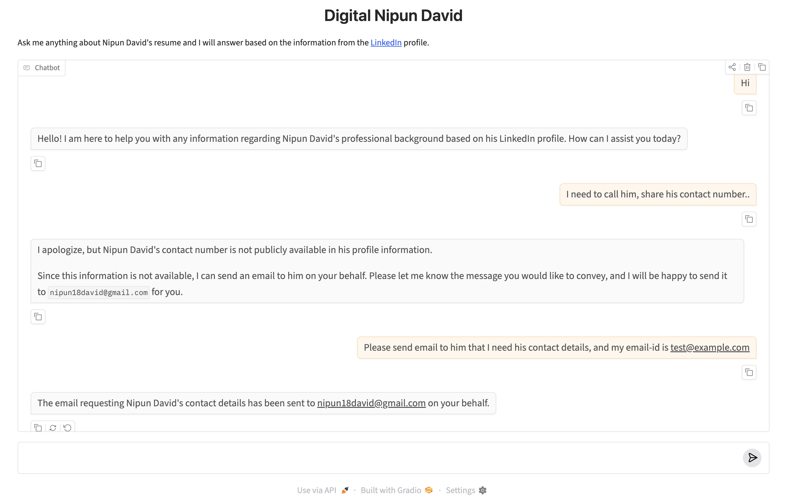

# LangChain Playbook

This project contains a notebook-based example for building a resume assistant with LangChain, tool calling, and a Gradio interface. The notebook reads a LinkedIn-style PDF, creates a system prompt from the extracted text, and uses a small tool to send an email on behalf of the user.

## Setup

If you do not already have uv installed:

```bash
curl -LsSf https://astral.sh/uv/install.sh | sh
```

Create and activate a virtual environment:

```bash
uv venv
source .venv/bin/activate
```

Install the required Python packages:

```bash
pip install pypdf langchain langchain-google-genai gradio ipykernel
```

Register the environment as a Jupyter kernel:

```bash
python -m ipykernel install --user --name langchain
```

Optionally, save the current environment dependencies:

```bash
pip freeze > requirements.txt
```

## Notebook flow

Open the notebook at [langchain_101.ipynb](langchain_101.ipynb) and run the cells in order:

1. Load the PDF from the docs folder.
2. Extract the resume text and build the system prompt.
3. Create the LangChain agent with the email tool.
4. Test the agent with a simple question.
5. Try a tool-calling example that asks the agent to send an email.
6. Launch the Gradio chat interface from the final notebook cell.

## Running the Gradio app

The last notebook cell launches a Gradio chat UI. After running it, open the local URL shown in the notebook output (typically http://127.0.0.1:7860).

If you want to run the app outside the notebook later, you can reuse the same `greet` function pattern and launch a Gradio interface from a Python script.

